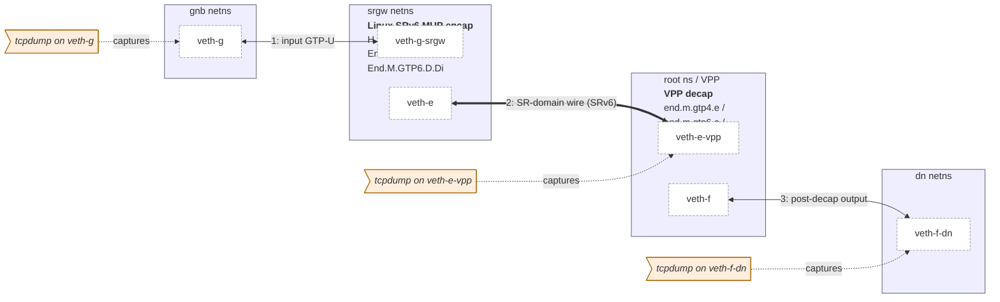
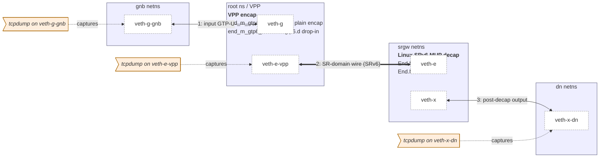

# Per-scenario topology

ASCII diagrams of the netns + veth topology used by each VPP interop
scenario. Every test runs entirely inside a single vng VM (no host
network exposure).

## Shared address plan

The same address plan is reused across all scenarios:

| Prefix | Purpose |
|---|---|
| `2001:db8:1::/64` | gnb ↔ srgw IPv6 link |
| `2001:db8:2::/64` | srgw ↔ VPP IPv6 link (SR-domain ingress side) |
| `2001:db8:3::/64` | VPP ↔ dn IPv6 link (post-decap GTP-U observation point) |
| `2001:db8:e::/88` | uplink IPv6 — End.M.GTP6.E SID locator |
| `2001:db8:f::/56` (IPv4 family) | End.M.GTP4.E / H.M.GTP4.D locator (`v4mask 32`, `sr_prefix_len 56`) |
| `2001:db8:f::/48` (IPv6 family) | End.M.GTP6.D routing prefix |
| `2001:db8:5::1/128` | downlink IPv4 — VPP SR Policy BSID |
| `2001:db8:6::/64` | downlink IPv6 — VPP `end.m.gtp6.d` localsid prefix |
| `10.0.0.0/24` | gnb ↔ srgw IPv4 link |
| `10.99.0.0/24` | "5G UPF egress" IPv4 (the End.M.GTP4.E DA recovery target) |
| `10.0.1.0/24` | VPP ↔ dn IPv4 link (egress GTP-U observation point) |

## Linux ingress scenarios — gnb → srgw → VPP → dn

Used by `vpp_interop_h_m_gtp4_d.sh`,
`vpp_interop_end_m_gtp6_d.sh`, and
`vpp_interop_end_m_gtp6_d_di.sh` (only the L3 protocol differs):



tcpdump is run at three points:

- gnb: `veth-g` — input GTP-U as the gNB sees it.
- root ns: `veth-e-vpp` — SR-domain wire (the emitted SRv6 packet).
- dn ns: `veth-f-dn` — output (post-decap GTP-U, or, for D.Di, the
  SRv6 packet after `End` processing).

`mergecap -w merged.pcap input.pcap srv6.pcap dn.pcap` joins the
three captures in time order so a single pcap shows the entire path.

## Linux egress scenarios — gnb → VPP → srgw → dn

Used by `vpp_interop_end_m_gtp4_e.sh` and `vpp_interop_end_m_gtp6_e.sh`:



## Roles and verification points per netns

### gnb

The simulated gNB / UE-facing side. Each script has a tiny scapy
program that emits exactly one packet:

- IPv4 family: `IP(dst=10.99.0.2)/UDP(dport=2152)/GTP-U(...)/IP/ICMP`
- IPv6 family: `IPv6(dst=2001:db8:f::1)/UDP/GTP-U/IPv6/ICMPv6`

### srgw

The Linux SR Gateway. Routes are installed through the patched
iproute2:

```bash
ip -n srgw -6 route add ... encap seg6local action <Behavior> ... dev veth-e
```

Sanity-check with `ip -n srgw -6 route show` after setup.

### root (VPP)

VPP runs in the root namespace using the host-installed `/usr/bin/vpp`
binary; it talks to the kernel via `af_packet_plugin.so`. CLI access:

```bash
vppctl -s /run/vpp/cli.sock show sr localsid
vppctl -s /run/vpp/cli.sock show sr policies
vppctl -s /run/vpp/cli.sock show errors
vppctl -s /run/vpp/cli.sock show trace
```

### dn

Just an observation point — tcpdump captures arriving packets and a
small scapy script asserts the relevant invariants (TEID, QFI, outer
DA, etc.).

## Why static ARP/ND is required

veth pairs do not auto-resolve ARP/ND reliably enough for these tests:

- The kernel ND machinery and VPP's af-packet input run in separate
  namespaces; resolution can be slow or fail silently.
- VPP's af-packet path consumes raw Ethernet frames, so it can both
  send and receive ND, but timing is sensitive.

Each script therefore installs explicit neighbor entries on both sides:

```bash
ip -n srgw -6 neigh replace 2001:db8:2::e dev veth-e \
    lladdr "$VPP_E_MAC" nud permanent
$VPPCTL set ip neighbor host-veth-e-vpp 2001:db8:2::1 $SRGW_E_MAC
```

The MAC used on the VPP side is the one from
`vppctl show hardware-interfaces host-veth-e-vpp` — which can differ
from the kernel veth's MAC.

## Why VPP host-interfaces are put in promiscuous mode

The af-packet host-interface only accepts unicast frames addressed to
its own MAC by default. To absorb every frame the kernel hands over
during these tests, each VPP-side host-interface is forced into
promiscuous mode:

```bash
$VPPCTL set int promiscuous on host-veth-e-vpp
$VPPCTL set int promiscuous on host-veth-f
```
