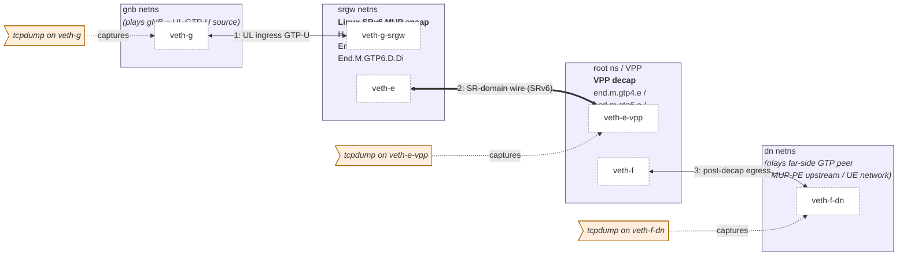
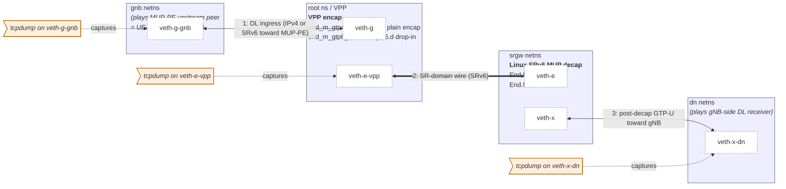

# Per-scenario topology

ASCII diagrams of the netns + veth topology used by each VPP interop
scenario. Every test runs entirely inside a single vng VM (no host
network exposure).

## Shared address plan

The same address plan is reused across all scenarios:

| Prefix | Purpose |
|---|---|
| `2001:db8:1::/64` | gnb ↔ srgw IPv6 link |
| `2001:db8:2::/64` | srgw ↔ VPP IPv6 link (SR-domain ingress side) |
| `2001:db8:3::/64` | far-side GTP-peer link (IPv6, post-decap observation) |
| `2001:db8:e::/88` | End.M.GTP6.E SID locator |
| `2001:db8:f::/56` (IPv4 family) | End.M.GTP4.E / H.M.GTP4.D locator (`v4_mask_len 32`, `sr_prefix_len 56`) |
| `2001:db8:f::/48` (IPv6 family) | End.M.GTP6.D routing prefix |
| `2001:db8:5::1/128` | VPP SR Policy BSID (encap-side scenarios) |
| `2001:db8:6::/64` | VPP `end.m.gtp6.d` localsid prefix |
| `10.0.0.0/24` | gnb ↔ srgw IPv4 link |
| `10.99.0.0/24` | far-side GTP-peer IPv4 address space (End.M.GTP4.E DA recovery target) |
| `10.0.1.0/24` | far-side GTP-peer IPv4 link (post-decap observation) |

## SRv6 MUP architecture mapping

The canonical SRv6 MUP architecture (no UPF in the data path) is:

```
UE ── MUP-PE ── (SR-domain, SRv6) ── MUP-GW ── gNB
```

- **MUP-PE**: SR-domain edge on the UE side. Terminates / originates SRv6
  toward the UE-network. Does *not* speak GTP-U.
- **MUP-GW**: SR-domain edge on the gNB side. Translates between
  GTP-U (toward gNB on N3) and SRv6 (toward MUP-PE).

The RFC 9433 §6 behaviors live at the **MUP-GW** position because they
bridge GTP-U and SRv6:

- D-family (encap): `H.M.GTP4.D`, `End.M.GTP6.D`, `End.M.GTP6.D.Di` —
  consume GTP-U from gNB, emit SRv6 into the SR-domain (UL).
- E-family (decap): `End.M.GTP4.E`, `End.M.GTP6.E` —
  consume SRv6, emit GTP-U toward gNB (DL).

In these interop scenarios both ends of the SR-domain run a §6 behavior
(both are **MUP-GW** instances). The framework therefore exercises a
"MUP-GW ↔ MUP-GW" GTP-preserving SR transit; a real deployment would
typically have one MUP-GW and one MUP-PE.

Per scenario:

| Script | Linux role | VPP role | Direction | gnb netns plays | dn netns plays |
|---|---|---|---|---|---|
| `vpp_interop_h_m_gtp4_d.sh` | MUP-GW (encap, §6.7) | MUP-GW (decap, §6.6) | UL (4G) | gNB / UL source | far-side GTP peer |
| `vpp_interop_end_m_gtp4_e.sh` | MUP-GW (decap, §6.6) | MUP-PE (plain SR encap workaround) | DL (4G) | DL source / far peer | gNB-side GTP receiver |
| `vpp_interop_end_m_gtp6_d.sh` | MUP-GW (encap, §6.3) | MUP-GW (decap, §6.5) | UL (5G) | gNB / UL source | far-side GTP peer |
| `vpp_interop_end_m_gtp6_e.sh` | MUP-GW (decap, §6.5) | MUP-GW (encap, §6.3 drop-in) | DL (5G) | DL source / far peer | gNB-side GTP receiver |
| `vpp_interop_end_m_gtp6_d_di.sh` | MUP-GW (encap drop-in, §6.4) | MUP-PE (RFC 8986 End) | UL drop-in | gNB / UL source | next-hop SR endpoint |

> Note: the `gnb` and `dn` netns names denote *test ingress* and
> *test egress* of the harness, **not** 3GPP roles. In E-family
> scenarios the test ingress is on the DL source side (= upstream of
> MUP-PE) and the test egress is the gNB receiving the GTP-U;
> in D-family scenarios the mapping is the opposite. The IP
> destinations advertised on the wire (`10.99.0.0/24`,
> `2001:db8:9::dead`, …) are simply the GTP-U outer-DA template the
> SID encodes, not "UPF" addresses.

## Linux ingress scenarios — gnb → srgw → VPP → dn

Used by `vpp_interop_h_m_gtp4_d.sh`,
`vpp_interop_end_m_gtp6_d.sh`, and
`vpp_interop_end_m_gtp6_d_di.sh` (only the L3 protocol differs):



tcpdump is run at three points:

- gnb: `veth-g` — test ingress GTP-U as the harness's gNB-role end sees
  it.  In these UL D-family scenarios the gnb netns is acting as gNB.
- root ns: `veth-e-vpp` — SR-domain wire (the emitted SRv6 packet).
- dn ns: `veth-f-dn` — test egress (post-decap GTP-U seen by the
  far-side GTP peer, or — for D.Di — the SRv6 packet after VPP `End`
  processing).

`mergecap -w merged.pcap input.pcap srv6.pcap dn.pcap` joins the
three captures in time order so a single pcap shows the entire path.

## Linux egress scenarios — gnb → VPP → srgw → dn

Used by `vpp_interop_end_m_gtp4_e.sh` and `vpp_interop_end_m_gtp6_e.sh`:



## Roles and verification points per netns

### gnb

The simulated gNB / UE-facing side. Each script has a tiny scapy
program that emits exactly one packet:

- IPv4 family: `IP(dst=10.99.0.2)/UDP(dport=2152)/GTP-U(...)/IP/ICMP`
- IPv6 family: `IPv6(dst=2001:db8:f::1)/UDP/GTP-U/IPv6/ICMPv6`

### srgw

The Linux SR Gateway. Routes are installed through the patched
iproute2:

```bash
ip -n srgw -6 route add ... encap seg6local action <Behavior> ... dev veth-e
```

Sanity-check with `ip -n srgw -6 route show` after setup.

### root (VPP)

VPP runs in the root namespace using the host-installed `/usr/bin/vpp`
binary; it talks to the kernel via `af_packet_plugin.so`. CLI access:

```bash
vppctl -s /run/vpp/cli.sock show sr localsid
vppctl -s /run/vpp/cli.sock show sr policies
vppctl -s /run/vpp/cli.sock show errors
vppctl -s /run/vpp/cli.sock show trace
```

### dn

The far-side observation stub. Despite the legacy name `dn`, this
netns is **not** a 3GPP DN — it stands in for whatever GTP-aware peer
sits beyond the SR-domain egress (gNB receiving DL N3, another MUP-GW
in a chain, or a 4G-side GW for §6.6 interop). tcpdump captures
arriving packets and a small scapy script asserts the relevant
invariants (TEID, QFI, outer DA, etc.).

## Why static ARP/ND is required

veth pairs do not auto-resolve ARP/ND reliably enough for these tests:

- The kernel ND machinery and VPP's af-packet input run in separate
  namespaces; resolution can be slow or fail silently.
- VPP's af-packet path consumes raw Ethernet frames, so it can both
  send and receive ND, but timing is sensitive.

Each script therefore installs explicit neighbor entries on both sides:

```bash
ip -n srgw -6 neigh replace 2001:db8:2::e dev veth-e \
    lladdr "$VPP_E_MAC" nud permanent
$VPPCTL set ip neighbor host-veth-e-vpp 2001:db8:2::1 $SRGW_E_MAC
```

The MAC used on the VPP side is the one from
`vppctl show hardware-interfaces host-veth-e-vpp` — which can differ
from the kernel veth's MAC.

## Why VPP host-interfaces are put in promiscuous mode

The af-packet host-interface only accepts unicast frames addressed to
its own MAC by default. To absorb every frame the kernel hands over
during these tests, each VPP-side host-interface is forced into
promiscuous mode:

```bash
$VPPCTL set int promiscuous on host-veth-e-vpp
$VPPCTL set int promiscuous on host-veth-f
```
