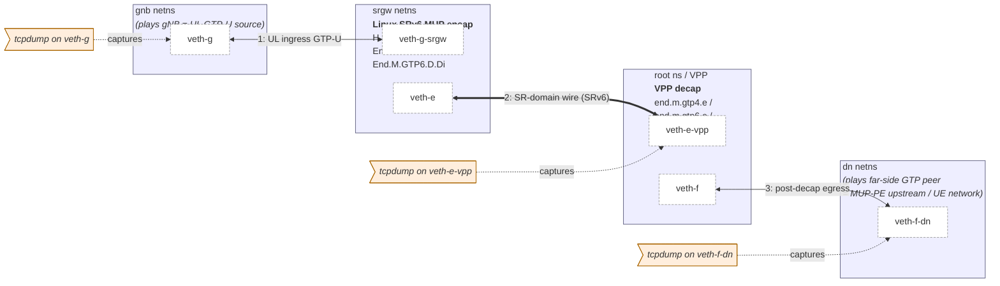
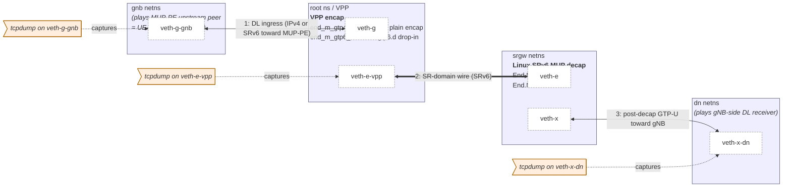

# Running the VPP interop tests

`tests/scenarios/vpp_interop_*/` (5 scenario directories) bring up VPP
and the Linux kernel inside the same vng VM and connect the SR-domain
via veth pairs.  Each scenario exercises one Linux MUP behavior
end-to-end against the FD.io VPP 25.10 `srv6-mobile` plugin (Arrcus
contribution).

## Prerequisites

On the host:

- VPP 25.10 from the FDio packagecloud repo:
  ```
  curl -sL https://packagecloud.io/fdio/2510/gpgkey | \
      sudo gpg --dearmor -o /etc/apt/trusted.gpg.d/fdio-2510.gpg
  echo "deb https://packagecloud.io/fdio/2510/debian bookworm main" | \
      sudo tee /etc/apt/sources.list.d/fdio-2510.list
  sudo apt-get update
  sudo apt-get install -y vpp vpp-plugin-core
  ```
  (the `bookworm` suite tag is for Debian 12 hosts; Ubuntu 24.04 LTS
  hosts should use `noble` instead)
- `pip install --user virtme-ng` or `apt install virtme-ng`
- `apt install python3-scapy tcpdump wireshark-common`
  (mergecap / tshark)

Source trees (default sibling layout — adjust `$ROOT` if your layout
differs):

- `<parent>/linux` — built (`make -j$(nproc) bzImage`).
- `<parent>/iproute2` — built (`make -j$(nproc)`).

## Run all five scenarios

```bash
ROOT=$(cd "$(dirname "$0")/.." && pwd)   # parent of linux/ iproute2/ srv6-mup-tests/
PCAP_DIR=$ROOT/srv6-mup-tests/pcaps
rm -f $PCAP_DIR/*.pcap

for s in vpp_interop_h_m_gtp4_d \
         vpp_interop_end_m_gtp4_e \
         vpp_interop_end_m_gtp6_d \
         vpp_interop_end_m_gtp6_e \
         vpp_interop_end_m_gtp6_d_di; do
  for try in 1 2; do
    script -q -c "vng -m 4G --rwdir=$PCAP_DIR \
      --run $ROOT/linux --user root \
      -- env PCAP_OUT=$PCAP_DIR \
         $ROOT/srv6-mup-tests/tests/scenarios/$s/$s.sh" \
      /tmp/run-$s.log >/dev/null 2>&1
    if grep -q 'VPP-INTEROP' /tmp/run-$s.log; then break; fi
  done
  echo "== $s =="
  grep -E 'VPP-INTEROP' /tmp/run-$s.log | tail -1
done

ls -la $PCAP_DIR/
```

The `for try in 1 2` retry guards against the (rare) `vng` exit-255
startup glitch when several VMs are spawned back-to-back.

## Expected output

```
== vpp_interop_h_m_gtp4_d ==
===VPP-INTEROP-H_M_GTP4_D=== PASS
== vpp_interop_end_m_gtp4_e ==
===VPP-INTEROP-END_M_GTP4_E=== PASS
== vpp_interop_end_m_gtp6_d ==
===VPP-INTEROP-END_M_GTP6_D=== PASS
== vpp_interop_end_m_gtp6_e ==
===VPP-INTEROP-END_M_GTP6_E=== PASS
== vpp_interop_end_m_gtp6_d_di ==
===VPP-INTEROP-END_M_GTP6_D_DI=== PASS
```

On success, each scenario writes a single merged pcap into `$PCAP_DIR`
that contains the three capture points (test ingress, SR-domain wire,
test egress) in time order — `mergecap`-joined inside the script.
The 3GPP role each end plays (gNB / MUP-PE upstream peer) depends on
the scenario direction; see the per-scenario role table below.

## Run a single scenario with full output

```bash
ROOT=$(cd "$(dirname "$0")/.." && pwd)
PCAP_DIR=$ROOT/srv6-mup-tests/pcaps
script -q -c "vng -m 4G --rwdir=$PCAP_DIR \
  --run $ROOT/linux --user root \
  -- env PCAP_OUT=$PCAP_DIR \
     $ROOT/srv6-mup-tests/tests/scenarios/vpp_interop_end_m_gtp6_d/vpp_interop_end_m_gtp6_d.sh" \
  /tmp/single.log
less /tmp/single.log                         # VPP trace / errors / verify
tshark -V -r $PCAP_DIR/end_m_gtp6_d.pcap     # full packet dissection
```

## Why each option is needed

- **`--rwdir=$PCAP_DIR`** — vng exposes the host filesystem read-only;
  `--rwdir` makes the given path writable in the guest. The script
  copies `/tmp/merged.pcap` to `$PCAP_OUT` (= the rwdir path) so the
  pcap survives after the VM exits.
- **`-m 4G`** — VPP's default config reserves ~1 GB for its main heap;
  with less than ~3 GB of guest RAM you hit
  `Main heap allocation failure!` at start-up.
- **`set -e`** at the top of every script — fail fast on any unexpected
  command exit.
- **`mount -t tmpfs tmpfs /tmp`** — VPP wants to write
  `/tmp/vpp/startup.conf`, `/run/vpp/cli.sock`, etc.; the guest `/tmp`
  is read-only otherwise.
- **`export PATH=.../iproute2/ip:$PATH`** — pick up the patched iproute2
  with MUP keywords.

## Per-scenario topology

Every scenario runs entirely inside a single vng VM (no host network
exposure).  The five scripts share two veth topologies; the difference
is which end plays Linux MUP encap vs. decap.

### Shared address plan

| Prefix | Purpose |
|---|---|
| `2001:db8:1::/64` | gnb ↔ srgw IPv6 link |
| `2001:db8:2::/64` | srgw ↔ VPP IPv6 link (SR-domain side) |
| `2001:db8:3::/64` | VPP ↔ dn IPv6 link (far-side observation) |
| `2001:db8::/32` | End.M.GTP4.E / H.M.GTP4.D SID locator (`v4_mask_len 32`, `sr_prefix_len 32`) — used by `vpp_interop_h_m_gtp4_d` and `vpp_interop_end_m_gtp4_e` |
| `2001:db8:f::/64` | End.M.GTP6.D / End.M.GTP6.D.Di routing prefix (also t.m.gtp6.e SID prefix on the egress side) — used by `vpp_interop_end_m_gtp6_{d,d_di,e}` |
| `2001:db8:e::/64` | VPP `end.m.gtp6.e` localsid prefix in `vpp_interop_end_m_gtp6_d` |
| `2001:db8:e::1/128` | VPP plain `End` (RFC 8986) localsid in `vpp_interop_end_m_gtp6_d_di` |
| `2001:db8:6::/64` | VPP `end.m.gtp6.d` localsid prefix in `vpp_interop_end_m_gtp6_e` |
| `2001:db8:5::1/128` | VPP `t.m.gtp4.d` outer BSID in `vpp_interop_end_m_gtp4_e` |
| `2001:db8:dead::1/128` | VPP "real-segment" SR policy transit segment in `vpp_interop_end_m_gtp4_e` (caught by srgw's plain `End` so SL drops to 0 before End.M.GTP4.E fires) |
| `10.0.0.0/24` | gnb ↔ srgw (or gnb ↔ VPP) IPv4 link |
| `10.99.0.0/24` | far-side IPv4 (encoded in End.M.GTP4.E / H.M.GTP4.D SID's IPv4 DA portion) |
| `10.0.1.0/24` | far-side IPv4 link (post-decap observation) |

### SRv6 MUP architecture mapping

The canonical SRv6 MUP architecture (no UPF in the data path) is:

```
UE ── MUP-PE ── (SR-domain, SRv6) ── MUP-GW ── gNB
```

- **MUP-PE**: SR-domain edge on the UE side.  Terminates / originates
  SRv6 toward the UE-network.  Does *not* speak GTP-U.
- **MUP-GW**: SR-domain edge on the gNB side.  Translates between
  GTP-U (toward gNB on N3) and SRv6 (toward MUP-PE).

The RFC 9433 §6 behaviors live at the **MUP-GW** position because they
bridge GTP-U and SRv6.  Note the action-name mnemonic — the suffix is
named after what the function does to the **GTP-U** header, which is
the opposite of what it does to the **SRv6** header:

- **D**-family (= GTP-U **D**ecap → SRv6 produced): `H.M.GTP4.D`,
  `End.M.GTP6.D`, `End.M.GTP6.D.Di`.  These consume GTP-U from gNB
  and emit SRv6 into the SR-domain (UL).
- **E**-family (= GTP-U **E**ncap ← SRv6 consumed): `End.M.GTP4.E`,
  `End.M.GTP6.E`.  These consume SRv6 and emit GTP-U toward gNB (DL).

In these interop scenarios both ends of the SR-domain run a §6
behavior (both are **MUP-GW** instances).  The setup therefore
exercises a "MUP-GW ↔ MUP-GW" GTP-preserving SR transit; a real
deployment would typically have one MUP-GW and one MUP-PE.

Per scenario (column "Linux/VPP transform" reads "what the node emits"):

| Script | Linux side | VPP side | Direction | gnb netns plays | dn netns plays |
|---|---|---|---|---|---|
| `vpp_interop_h_m_gtp4_d` | H.M.GTP4.D §6.7 (GTP-U → SRv6) | end.m.gtp4.e §6.6 (SRv6 → GTP-U) | UL (4G) | gNB / UL source | far-side GTP peer |
| `vpp_interop_end_m_gtp4_e` | End.M.GTP4.E §6.6 (SRv6 → GTP-U) | sr policy + plain encap (IPv4 → SRv6) | DL (4G) | DL source (MUP-PE upstream peer) | gNB-side GTP receiver |
| `vpp_interop_end_m_gtp6_d` | End.M.GTP6.D §6.3 (GTP-U → SRv6) | End.DT6 RFC 8986 §4.8 (SRv6 → IPv6) | UL (5G) | gNB / UL source | far-side IPv6 peer |
| `vpp_interop_end_m_gtp6_e` | End.M.GTP6.E §6.5 (SRv6 → GTP-U) | end.m.gtp6.d drop-in §6.3 (GTP-U → SRv6 inline) | DL (5G) | DL source (MUP-PE upstream peer) | gNB-side GTP receiver |
| `vpp_interop_end_m_gtp6_d_di` | End.M.GTP6.D.Di §6.4 (GTP-U → SRv6 inline) | End (RFC 8986 transit) | UL drop-in | gNB / UL source | next-hop SR endpoint |

> Note: the `gnb` and `dn` netns names denote *test ingress* and
> *test egress*, **not** 3GPP roles.  In E-family scenarios the test
> ingress is on the DL source side (= upstream of MUP-PE) and the
> test egress is the gNB receiving the GTP-U; in D-family scenarios
> the mapping is the opposite.  The IP destinations advertised on
> the wire (`10.99.0.0/24`, `2001:db8:9::dead`, …) are simply the
> GTP-U outer-DA template the SID encodes, not "UPF" addresses.

### Linux ingress scenarios — gnb → srgw → VPP → dn

Used by `vpp_interop_h_m_gtp4_d`,
`vpp_interop_end_m_gtp6_d`, and
`vpp_interop_end_m_gtp6_d_di` (only the L3 protocol differs):

```
[gnb netns]                        <-- plays gNB (UL GTP-U source)
   |  veth-g <-> veth-g-srgw
[srgw netns]                       <-- Linux SRv6 MUP encap
   |                                   (H.M.GTP4.D /
   |                                    End.M.GTP6.D /
   |                                    End.M.GTP6.D.Di)
   |  veth-e <-> veth-e-vpp
[root ns / VPP]                    <-- VPP decap
   |                                   (end.m.gtp4.e /
   |                                    end.m.gtp6.e /
   |                                    End RFC 8986)
   |  veth-f <-> veth-f-dn
[dn netns]                         <-- plays far-side GTP peer
                                       (= MUP-PE upstream / UE network)
```



tcpdump runs at three points:

- gnb: `veth-g` — test ingress GTP-U as the gNB-role end sees it.
  In these UL D-family scenarios the gnb netns is acting as gNB.
- root ns: `veth-e-vpp` — SR-domain wire (the emitted SRv6 packet).
- dn ns: `veth-f-dn` — test egress (post-decap GTP-U seen by the
  far-side GTP peer, or — for D.Di — the SRv6 packet after VPP `End`
  processing).

`mergecap -w merged.pcap input.pcap srv6.pcap dn.pcap` joins the
three captures in time order so a single pcap shows the entire path.

### Linux egress scenarios — gnb → VPP → srgw → dn

Used by `vpp_interop_end_m_gtp4_e` and `vpp_interop_end_m_gtp6_e`:

```
[gnb netns]                        <-- plays MUP-PE upstream peer
   |                                   (= UE-network DL source)
   |  veth-g-gnb <-> veth-g
[root ns / VPP]                    <-- VPP encap
   |                                   (end_m_gtp4_e: sr policy + plain encap;
   |                                    end_m_gtp6_e: end.m.gtp6.d drop-in)
   |  veth-e-vpp <-> veth-e
[srgw netns]                       <-- Linux SRv6 MUP decap
   |                                   (End.M.GTP4.E /
   |                                    End.M.GTP6.E)
   |  veth-x <-> veth-x-dn
[dn netns]                         <-- plays gNB-side DL receiver
```



For DL (E-family) scenarios where VPP is the encap side, capture the
SR-domain wire on the **srgw-side** veth peer (`veth-e` inside `srgw`
netns), not on the VPP-side `veth-e-vpp` — VPP's af_packet TX is
invisible to tcpdump on the same iface.

### Roles and verification points per netns

#### gnb

The simulated gNB / UE-facing side.  Each script has a tiny scapy
program that emits exactly one packet:

- IPv4 family: `IP(dst=10.99.0.2)/UDP(dport=2152)/GTP-U(...)/IP/ICMP`
- IPv6 family: `IPv6(dst=2001:db8:f::1)/UDP/GTP-U/IPv6/ICMPv6`

#### srgw

The Linux SR Gateway.  Routes are installed through the patched
iproute2:

```bash
ip -n srgw -6 route add ... encap seg6local action <Behavior> ... dev veth-e
```

Sanity-check with `ip -n srgw -6 route show` after setup.

#### root (VPP)

VPP runs in the root namespace using the host-installed `/usr/bin/vpp`
binary; it talks to the kernel via `af_packet_plugin.so`.  CLI access:

```bash
vppctl -s /run/vpp/cli.sock show sr localsid
vppctl -s /run/vpp/cli.sock show sr policies
vppctl -s /run/vpp/cli.sock show errors
vppctl -s /run/vpp/cli.sock show trace
```

#### dn

The far-side observation stub.  Despite the legacy name `dn`, this
netns is **not** a 3GPP DN — it stands in for whatever GTP-aware peer
sits beyond the SR-domain egress (gNB receiving DL N3, another MUP-GW
in a chain, or a 4G-side GW for §6.6 interop).  tcpdump captures
arriving packets and a small scapy script asserts the relevant
invariants (TEID, QFI, outer DA, etc.).

### Why static ARP/ND is required

veth pairs do not auto-resolve ARP/ND reliably enough for these tests:

- The kernel ND machinery and VPP's af-packet input run in separate
  namespaces; resolution can be slow or fail silently.
- VPP's af-packet path consumes raw Ethernet frames, so it can both
  send and receive ND, but timing is sensitive.

Each script therefore installs explicit neighbor entries on both sides:

```bash
ip -n srgw -6 neigh replace 2001:db8:2::e dev veth-e \
    lladdr "$VPP_E_MAC" nud permanent
$VPPCTL set ip neighbor host-veth-e-vpp 2001:db8:2::1 $SRGW_E_MAC
```

The MAC used on the VPP side is the one from
`vppctl show hardware-interfaces host-veth-e-vpp` — which can differ
from the kernel veth's MAC.

### Why VPP host-interfaces are put in promiscuous mode

The af-packet host-interface only accepts unicast frames addressed to
its own MAC by default.  To absorb every frame the kernel hands over
during these tests, each VPP-side host-interface is forced into
promiscuous mode:

```bash
$VPPCTL set int promiscuous on host-veth-e-vpp
$VPPCTL set int promiscuous on host-veth-f
```

## VPP commands used by each script

| Script | VPP configuration |
|---|---|
| `vpp_interop_h_m_gtp4_d` | `sr localsid prefix 2001:db8:f::/56 behavior end.m.gtp4.e v4src_position 96 fib-table 0` |
| `vpp_interop_end_m_gtp4_e` | `sr policy add bsid 2001:db8:5::1 next 2001:db8:f::a:6300:214:0:123 encap` + `sr steer l3 10.99.0.0/24 via bsid 2001:db8:5::1` |
| `vpp_interop_end_m_gtp6_d` | `sr localsid address 2001:db8:e:0:0:14:0:123 behavior end.dt6 0` (full SID = locator+function /88 + Args.Mob.Session for TEID=0x123, QFI=5) |
| `vpp_interop_end_m_gtp6_e` | `sr localsid prefix 2001:db8:6::/64 behavior end.m.gtp6.d 2001:db8:f::/88 nh-type ipv6 fib-table 0 drop-in` |
| `vpp_interop_end_m_gtp6_d_di` | `sr localsid address 2001:db8:e::1 behavior end` (RFC 8986 plain End) |

## Troubleshooting

### VPP fails to start

- Inspect `/tmp/vpp/stdout.log` inside the VM. `Main heap allocation
  failure!` means `-m` is too small; bump it to `-m 4G` or higher.
- `srv6mobile_plugin.so not found` — install `vpp-plugin-core` on the
  host.

### `Invalid behavior` from `vppctl`

VPP's per-plugin behavior `unformat()` callbacks consume input until
EOF or an unknown token. If `encap` follows `behavior <name> ...` on the
same CLI line, the plugin's parser sees `encap` as an unknown token and
returns 0; the outer parser then prints `sr policy: Invalid behavior`.
Put `encap` *before* `behavior` so the outer parser eats it first.

### Manual neighbor entries

veth pairs do not auto-resolve ARP/ND across the host/netns boundary
reliably enough for these tests. All scripts install static
`ip neigh`/`vppctl set ip neighbor` entries before traffic. When VPP is
on one end, take the MAC from `vppctl show hardware-interfaces ...`
(VPP's af-packet MAC may differ from the kernel veth MAC).

### `Length: 40 (Malformed)` warnings on the gnb-side capture

This was the symptom of a hard-coded, off-by-four GTP-U `Length` field
in the scapy crafting code; fixed and squashed into the patches that
introduce each affected selftest. If you craft your own GTP-U packets,
remember `Length = 4 (long-opts) + 4 (PSC) + len(inner T-PDU)`.

## Known limitations

- **VPP `t.m.gtp4.d`** (the VPP-side equivalent of RFC §6.7 H.M.GTP4.D)
  does not chain through to the SRv6 encap node when activated via
  `sr policy add ... behavior t.m.gtp4.d ...` on VPP 25.10 / FDio
  master (2026-04-20); it returns "T.M.GTP4.D bad packets" without
  emitting an SRv6 packet. The `vpp_interop_end_m_gtp4_e` scenario
  works around this by using a plain `sr policy ... next ... encap`,
  which simply wraps the entire incoming IPv4/UDP/GTP-U datagram inside
  SRv6. As a side-effect the egress pcap shows a doubled GTP-U header
  (Linux End.M.GTP4.E re-encapsulates the inner — which is itself a
  GTP-U from the gNB — into a fresh GTP-U whose TEID/QFI come from the
  SID's `Args.Mob.Session`). The verification checks only the outer
  TEID, which is sufficient to prove that Linux End.M.GTP4.E is
  decoding the SID correctly.

- **End.MAP (§6.2)** and **End.Limit (§6.8)** are not implemented in the
  VPP `srv6-mobile` plugin, so they are exercised by the kernel
  selftests only.
